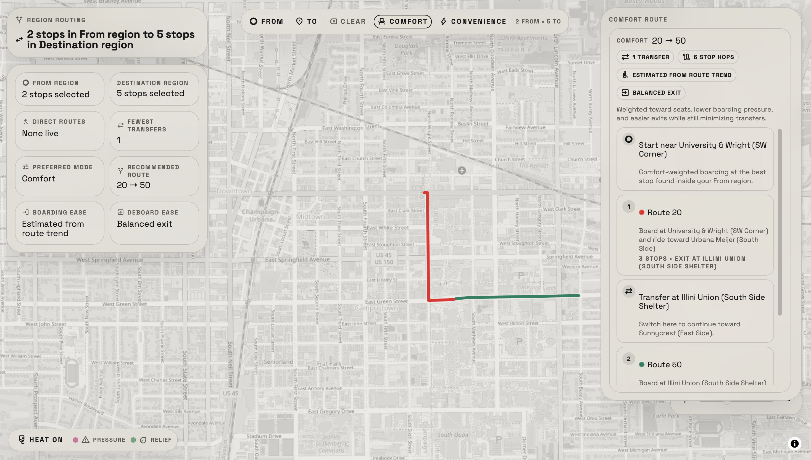
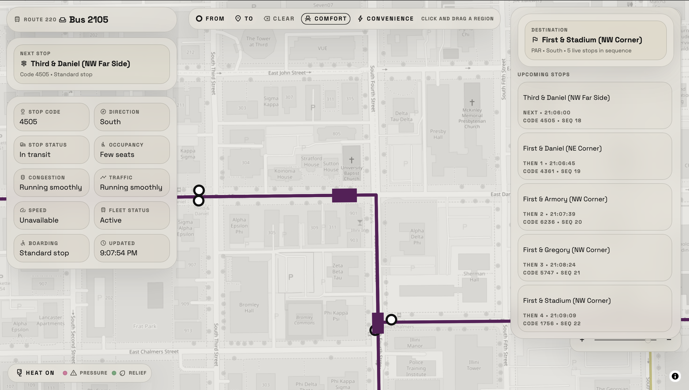
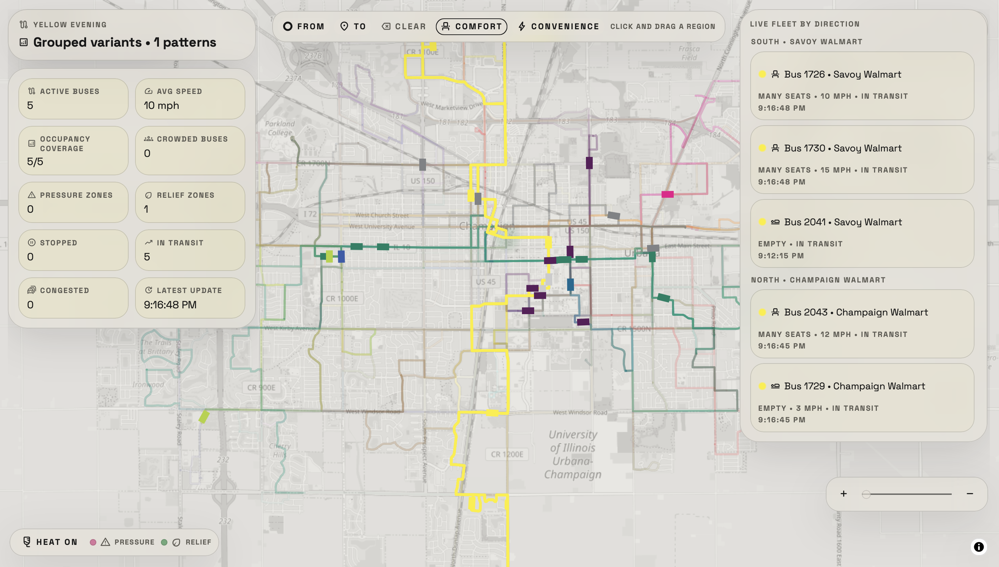
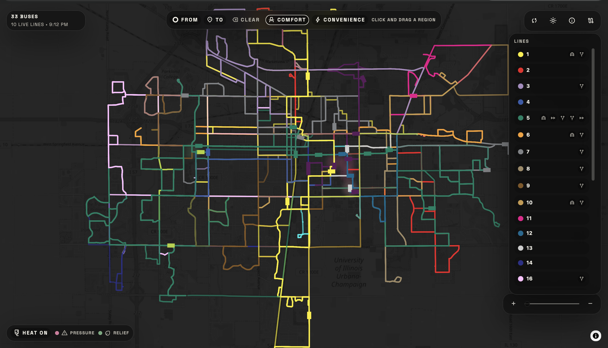
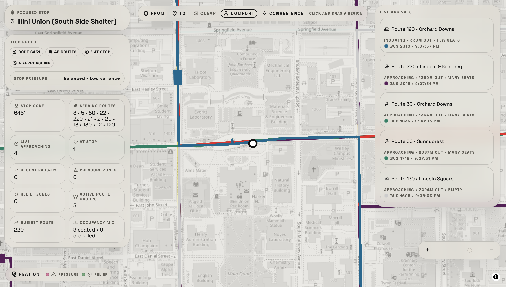

# MTD Champaign-Urbana Live Dashboard

Static CU-MTD dashboard inspired by Mini Metro, built to help riders understand crowding and make better boarding and deboarding decisions in real time.

## What it does

- Uses a minimal, Mini Metro-inspired visual language to show the CU-MTD network as a live operational map
- Tries to surface where congestion and rider pressure are building, especially around stops and route segments
- Helps approximate the best place to get on and get off based on two rider priorities:
  - `Comfort`: weighted toward easier boarding, better seat odds, and smoother exits
  - `Convenience`: weighted toward directness, lower transfer count, and faster movement



- Uses the current MTD developer API at `https://api.mtd.dev`
- Uses a split local GTFS cache so the map boots from a small core payload and loads trip-stop detail lazily
- Hits the live API only for `GET /vehicles/locations`
- Preloads `GET /vehicles` once for fleet metadata used in bus detail cards
- Reads MTD GTFS-realtime vehicle positions for occupancy, stop-status, and congestion fields
- Stores your `X-ApiKey` only in local browser storage
- Renders a MapLibre-powered live tiled basemap with a minimal Mini Metro-inspired route overlay
- Click a bus to open a compact vehicle profile with live occupancy/congestion and upcoming stops

- Click a route to open a route analysis panel with active fleet and occupancy-pressure insights

- Adds a fading pink/green occupancy-change overlay keyed to stops or nearby blocks

- Includes a heatmap toggle and legend in the HUD
- Supports dark and light themes

## What it is trying to solve

This project is aimed at a practical rider problem rather than only map visualization:

- some stops are easier to board from than others at a given moment
- some buses are more crowded before they reach you
- some exits are easier than others depending on current stop pressure
- the best ride is not always just the shortest one

The planner and overlays try to approximate the best steps to board and deboard using live occupancy, stop pressure, route geometry, and low-transfer pathfinding. It is not claiming perfect trip planning accuracy; it is trying to make the rider’s next decision clearer.



## Local run

1. Build the local GTFS cache:

```bash
python3 scripts/build_gtfs_cache.py
```

2. Serve the folder with any static file server. For example:

```bash
python3 -m http.server 8000
```

3. Open `http://localhost:8000`.

## Notes

- Default live polling is one request every 2 minutes, and polling pauses while the tab is hidden.
- Route lines and trip-to-shape mapping come from the local GTFS cache, so there are no live trip or shape API calls at runtime.
- The startup-critical GTFS core is separated from trip-stop sequences, which reduces initial load time substantially.
- Occupancy hotspots are derived from changes between consecutive GTFS-realtime vehicle snapshots rather than from any extra analytics endpoint.
- Bus detail cards derive stop sequences from the GTFS cache and only hit the next-stop departures endpoint when a bus is selected.
- Route highlighting, route fade, and stop overlays are rendered client-side from the cached GTFS geometry.
- `scripts/build_gtfs_cache.py` also writes `data/runtime-config.json` from `.env`, so the browser automatically picks up your local API key and refresh interval.

## Env vars

- `API_KEY`: MTD developer API key
- `REFRESH_INTERVAL_MS`: live refresh interval in milliseconds
- `TILE_URL`: optional raster tile URL template
- `TILE_ATTRIBUTION`: optional tile attribution HTML
- `TILE_MAX_ZOOM`: optional tile max zoom
- `INITIAL_THEME`: `light` or `dark`

# I KNOW MY API KEY IS PUBLIC, IT'S THERE ON PURPOSE!!!
# I JUST NEEDED TO GET A POC OUT TO TEST THIS NEWLY RELEASED API
